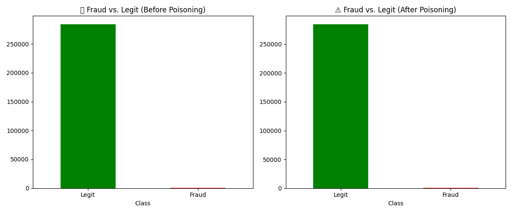
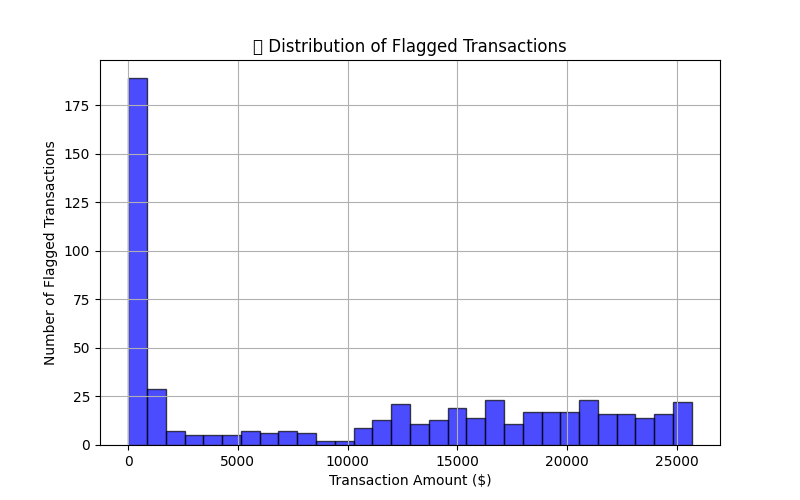

# 🛡️ Secure AI Pipeline: Detecting Data Poisoning in Machine Learning  

  
  
  
  

## 📖 Table of Contents  
- [Project Overview](#-secure-ai-pipeline-detecting-data-poisoning-in-machine-learning)  
- [How It Works](#-how-it-works)  
- [Data Insights & Visualizations](#-data-insights--visualizations)  
- [Setup & Run the Project](#-setup--run-the-project)  
- [Project Structure](#-project-structure)  
- [Future Improvements](#-future-improvements)  
- [Author](#-author)  

🚀 **Project Overview**  
This project explores **data poisoning attacks** on machine learning models and implements **AI security defenses** to detect and mitigate poisoned data.  

📌 **Key Features:**  
✅ Loads and processes a **real-world fraud detection dataset** 📊  
✅ **Simulates data poisoning attacks** (flipping fraud cases + injecting fake transactions) 😈  
✅ **Detects poisoned data** using **rule-based filtering** and **anomaly detection (Isolation Forest)** 🛡️  
✅ **Exports flagged transactions** for further analysis 📂  

---

## **🔍 How It Works**
1️⃣ **Load Dataset:** Imports a real-world credit card fraud dataset  
2️⃣ **Simulate Attack:** Flips fraud labels & injects 500 fake transactions  
3️⃣ **Analyze Poisoned Data:** Identifies fraud shifts & statistical anomalies  
4️⃣ **Detect Poisoning:** Uses rule-based filtering + Isolation Forest to flag suspicious transactions  
5️⃣ **Save Results:** Exports flagged data to `flagged_transactions.csv`  

---

## **📊 Data Insights & Visualizations**  
Here are key findings from the poisoned dataset and security analysis:

🔹 **Before Poisoning:**  
- Fraud made up **0.1727%** of all transactions  
- The dataset was clean and balanced  

🔹 **After Poisoning:**  
- Fraud rate dropped to **0.1381%** (hidden fraud cases)  
- **500 fake transactions** were injected  
- **561 total transactions flagged** as suspicious 🛑  

📉 ## **📊 Data Insights & Visualizations**  

### 🔹 **Fraud Transactions Before vs. After Poisoning**  
This bar chart compares fraud cases before and after data poisoning.  



---

### 🔹 **Distribution of Flagged Transactions**  
This histogram shows the **transaction amounts of flagged fraudulent transactions.**  




## **💻 Setup & Run the Project**
### **1️⃣ Install Dependencies**  
Ensure you have **Python 3+** installed, then run:  
```bash
pip install -r requirements.txt

## **👨‍💻 Author**
💡 **SilverBomb-Gaming** (GitHub: [SilverBomb-Gaming](https://github.com/SilverBomb-Gaming))  
🔗 **LinkedIn:** [SilverBombGaming](https://www.linkedin.com/in/silverbombgaming/)  

